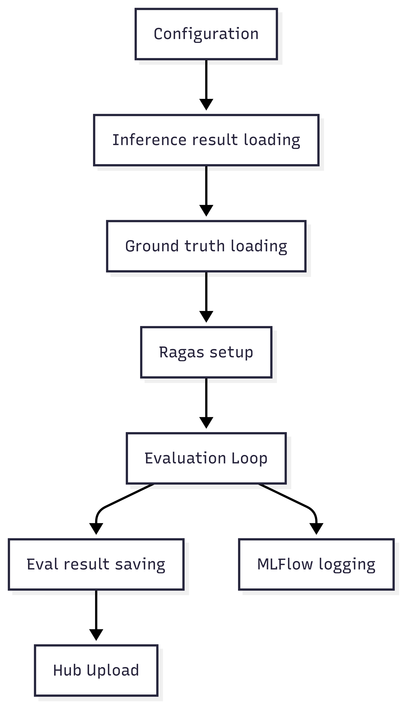

# Evaluator Component

The Evaluator component provides comprehensive assessment of your fine-tuned model's performance using multiple evaluation metrics, from traditional n-gram based scores to advanced LLM-based evaluation.

## Overview

The `Evaluator` class in `app/evaluator.py` handles:

1. **Multi-Metric Evaluation**: BLEU, ROUGE, semantic similarity, and LLM-based metrics
2. **Automated Scoring**: Processes inference outputs and computes scores
3. **Detailed Reporting**: Generates summary and detailed evaluation reports
4. **Flexible Configuration**: Choose metrics based on your evaluation needs

## Key Features

- ✅ **Traditional Metrics**: BLEU, ROUGE scores for standard evaluation
- ✅ **LLM-Based Evaluation**: GPT-powered factual correctness and relevancy assessment
- ✅ **Semantic Similarity**: Embedding-based meaning comparison
- ✅ **Comprehensive Reports**: JSON summaries and Excel detailed reports
- ✅ **Cost Management**: Configurable metrics to control API usage
- ✅ **Batch Processing**: Efficient evaluation of large datasets

## Architecture



## Usage

### Basic Usage

```python
from app.evaluator import Evaluator

# Initialize with default configuration
evaluator = Evaluator()

# Run evaluation on inference results
scores = evaluator.run()
print(f"Overall BLEU score: {scores['bleu_score']}")
```

### Custom Configuration

```python
from app.config_manager import ConfigManager
from app.evaluator import Evaluator

# Load custom configuration
config_manager = ConfigManager("custom_config.toml")
evaluator = Evaluator(config_manager=config_manager)

# Run evaluation with specific metrics
scores = evaluator.run()
```

### Command Line Usage

```bash
# Basic evaluation (traditional metrics only)
uv run app/evaluator.py

# With LLM-based evaluation
uv run app/evaluator.py --openai-key "your_openai_key"

# Using environment variables
export OPENAI_API_KEY="your_key"
uv run app/evaluator.py
```

## Supported Metrics

### Traditional Metrics

#### BLEU Score
- **Purpose**: Measures n-gram overlap with reference text
- **Range**: 0-100 (higher is better)
- **Best for**: Translation, text generation quality
- **Cost**: Free

```python
bleu_score = evaluator.compute_bleu(predictions, references)
```

#### ROUGE Score  
- **Purpose**: Measures recall of important content
- **Range**: 0-1 (higher is better)
- **Best for**: Summarization, content coverage
- **Cost**: Free

```python
rouge_scores = evaluator.compute_rouge(predictions, references)
# Returns: {'rouge-1', 'rouge-2', 'rouge-l'}
```

### LLM-Based Metrics

#### Factual Correctness
- **Purpose**: Verifies factual accuracy using LLM
- **Range**: 0-1 (higher is better)
- **Best for**: QA, factual content
- **Cost**: ~$0.01-0.05 per sample

```python
factual_score = evaluator.compute_factual_correctness(
    question, prediction, ground_truth
)
```

#### Answer Accuracy
- **Purpose**: Overall answer correctness assessment
- **Range**: 0-1 (higher is better)  
- **Best for**: General QA tasks
- **Cost**: ~$0.01-0.05 per sample

#### Answer Relevancy
- **Purpose**: Measures response relevance to question
- **Range**: 0-1 (higher is better)
- **Best for**: Conversational AI, chat systems
- **Cost**: ~$0.01-0.05 per sample

### Embedding-Based Metrics

#### Semantic Similarity
- **Purpose**: Measures meaning similarity using embeddings
- **Range**: 0-1 (higher is better)
- **Best for**: Paraphrasing, semantic equivalence
- **Cost**: ~$0.0001 per sample

```python
similarity = evaluator.compute_semantic_similarity(
    prediction, ground_truth, embedding_model
)
```

## Core Methods

### `load_inference_results()`

Loads the inference results from `inferencer_output.jsonl`.

```python
results = evaluator.load_inference_results()
```

**Data Format Expected:**
```json
{
    "question": "What is AI?",
    "predicted_answer": "AI is artificial intelligence...",
    "ground_truth": "Artificial intelligence is...",
    "metadata": {...}
}
```

### `compute_traditional_metrics()`

Computes BLEU and ROUGE scores for all samples.

```python
traditional_scores = evaluator.compute_traditional_metrics(
    predictions, references
)
```

**Returns:**
```python
{
    "bleu_score": 25.4,
    "rouge_1": 0.68,
    "rouge_2": 0.45,
    "rouge_l": 0.62
}
```

### `compute_llm_metrics()`

Computes LLM-based evaluation metrics.

```python
llm_scores = evaluator.compute_llm_metrics(
    questions, predictions, references
)
```

**Features:**
- Batch processing for efficiency
- Error handling and retry logic
- Cost tracking and reporting
- Progress monitoring

### `generate_reports()`

Creates comprehensive evaluation reports.

```python
evaluator.generate_reports(all_scores)
```

**Outputs:**
- `evaluator_output_summary.json`: Overall metrics
- `evaluator_output_detailed.xlsx`: Per-sample analysis

## Evaluation Process

### 1. Data Loading

```python
# Load inference results
inference_data = evaluator.load_inference_results()

# Validate data format
evaluator.validate_data_format(inference_data)
```

### 2. Metric Computation

```python
# Traditional metrics (fast, free)
if "bleu_score" in config.metrics:
    bleu_scores = evaluator.compute_bleu_batch(predictions, references)

if "rouge_score" in config.metrics:
    rouge_scores = evaluator.compute_rouge_batch(predictions, references)

# LLM-based metrics (slower, costs API calls)
if "factual_correctness" in config.metrics:
    factual_scores = evaluator.compute_factual_correctness_batch(
        questions, predictions, references
    )
```

### 3. Report Generation

```python
# Aggregate all scores
aggregated_scores = evaluator.aggregate_scores(all_metrics)

# Generate summary report
evaluator.save_summary_report(aggregated_scores)

# Generate detailed Excel report
evaluator.save_detailed_report(individual_scores)
```

## Configuration Examples

### Research Evaluation

```python
config = {
    "metrics": [
        "bleu_score",
        "rouge_score", 
        "factual_correctness",
        "semantic_similarity",
        "answer_accuracy"
    ],
    "llm": "gpt-4o",
    "embedding": "text-embeddings-3-large"
}
```

### Production Monitoring

```python
config = {
    "metrics": ["bleu_score", "semantic_similarity"],
    "llm": "gpt-4o-mini",
    "embedding": "text-embeddings-3-small"
}
```

### Budget-Conscious Evaluation

```python
config = {
    "metrics": ["bleu_score", "rouge_score"],
    "llm": None,  # No LLM-based metrics
    "embedding": None
}
```

## Report Formats

### Summary Report (JSON)

```json
{
    "overall_scores": {
        "bleu_score": 25.4,
        "rouge_1": 0.68,
        "rouge_2": 0.45,
        "rouge_l": 0.62,
        "semantic_similarity": 0.82,
        "factual_correctness": 0.76
    },
    "sample_statistics": {
        "total_samples": 100,
        "successful_evaluations": 98,
        "failed_evaluations": 2
    },
    "cost_breakdown": {
        "llm_api_calls": 98,
        "embedding_api_calls": 100,
        "estimated_cost_usd": 4.85
    },
    "metadata": {
        "evaluation_time": "2025-06-29T14:30:22Z",
        "metrics_used": ["bleu_score", "rouge_score", "factual_correctness"],
        "model_evaluated": "username/model-name",
        "evaluator_config": {...}
    }
}
```

### Detailed Report (Excel)

**Sheets:**
1. **Sample_Scores**: Individual scores per sample
2. **Summary_Stats**: Statistical analysis
3. **Score_Distribution**: Histogram data
4. **Error_Analysis**: Failed evaluations

**Columns:**
- Sample ID
- Question
- Predicted Answer
- Ground Truth
- BLEU Score
- ROUGE Scores
- Semantic Similarity
- LLM-based Scores
- Error Messages (if any)

## Performance Optimization

### Cost Management

```python
# Estimate costs before evaluation
estimated_cost = evaluator.estimate_evaluation_cost(
    sample_count=1000,
    metrics=["factual_correctness", "semantic_similarity"]
)
print(f"Estimated cost: ${estimated_cost:.2f}")
```

### Batch Processing

```python
# Process in batches to manage memory and API limits
for batch in evaluator.batch_iterator(data, batch_size=10):
    batch_scores = evaluator.evaluate_batch(batch)
    evaluator.save_intermediate_results(batch_scores)
```

### Caching

```python
# Cache expensive computations
evaluator.enable_caching = True
evaluator.cache_embeddings = True
evaluator.cache_llm_responses = True
```

## Error Handling

### API Errors

```python
try:
    scores = evaluator.compute_llm_metrics(data)
except OpenAIError as e:
    if "rate_limit" in str(e):
        # Implement exponential backoff
        time.sleep(60)
        scores = evaluator.compute_llm_metrics(data)
    elif "insufficient_quota" in str(e):
        # Fall back to traditional metrics
        scores = evaluator.compute_traditional_metrics(data)
```

### Data Validation

```python
# Validate input data
try:
    evaluator.validate_data_format(inference_data)
except ValidationError as e:
    print(f"Data format error: {e}")
    # Handle missing fields or incorrect format
```

## Integration with Pipeline

### Complete Pipeline Flow

```python
# 1. Fine-tune model
fine_tuner = FineTune()
trainer_stats = fine_tuner.run()

# 2. Generate predictions
inferencer = Inferencer()
predictions = inferencer.run()

# 3. Evaluate predictions
evaluator = Evaluator()
evaluation_scores = evaluator.run()

# 4. Report results
print(f"Training Loss: {trainer_stats.training_loss}")
print(f"BLEU Score: {evaluation_scores['bleu_score']}")
print(f"Semantic Similarity: {evaluation_scores['semantic_similarity']}")
```

### Automated Reporting

```python
class PipelineReporter:
    def __init__(self):
        self.fine_tuner = FineTune()
        self.inferencer = Inferencer()
        self.evaluator = Evaluator()
    
    def run_complete_evaluation(self):
        # Run complete pipeline
        training_stats = self.fine_tuner.run()
        inference_results = self.inferencer.run()
        evaluation_scores = self.evaluator.run()
        
        # Generate comprehensive report
        self.generate_pipeline_report(
            training_stats, inference_results, evaluation_scores
        )
```

## Best Practices

### Metric Selection
- Use BLEU/ROUGE for baseline evaluation
- Add semantic similarity for meaning comparison  
- Include LLM metrics for nuanced evaluation
- Consider cost vs. quality tradeoffs

### Quality Assurance
- Validate data format before evaluation
- Review sample results manually
- Compare multiple metrics for comprehensive assessment
- Monitor evaluation costs and API usage

### Reporting
- Save detailed results for analysis
- Include confidence intervals where applicable
- Document evaluation methodology
- Track evaluation metrics over time for model improvement
