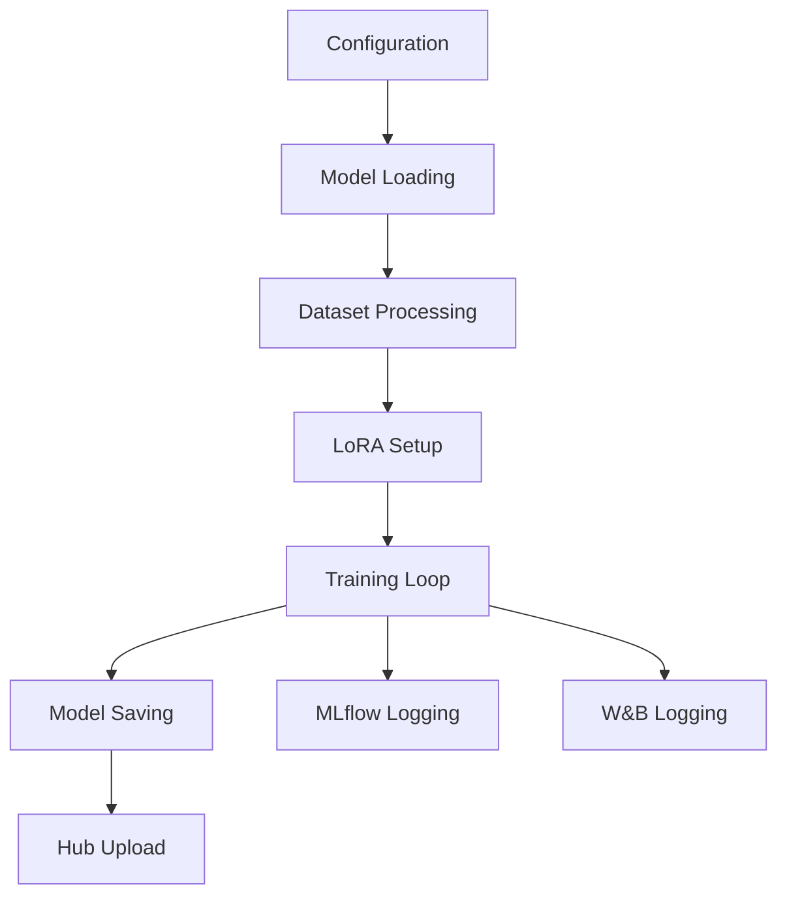

# Fine-Tuner Component

The Fine-Tuner is the core component responsible for training language models using Parameter-Efficient Fine-Tuning (PEFT) techniques, specifically LoRA (Low-Rank Adaptation).

## Overview

The `FineTune` class in `app/finetuner.py` handles the complete fine-tuning pipeline:

1. **Model Loading**: Downloads and prepares the base model
2. **Data Processing**: Converts datasets to the required format
3. **Training**: Executes the fine-tuning process
4. **Saving**: Saves the model locally and to Hugging Face Hub

## Key Features

- ✅ **LoRA Fine-Tuning**: Memory-efficient training with Low-Rank Adaptation
- ✅ **4-bit/8-bit Quantization**: Reduce memory usage without sacrificing quality
- ✅ **Chat Template Support**: Automatic formatting for conversational models
- ✅ **MLflow Integration**: Comprehensive experiment tracking and model logging
- ✅ **Weights & Biases Integration**: Additional experiment tracking capabilities
- ✅ **Hub Integration**: Automatic model publishing to Hugging Face
- ✅ **Gradient Checkpointing**: Memory optimization for large models
- ✅ **Response-Only Training**: Train only on assistant responses

## Architecture



## Usage

### Basic Usage

```python
from app.finetuner import FineTune

# Initialize with default configuration
tuner = FineTune()

# Run the fine-tuning process
trainer_stats = tuner.run()
```

### Custom Configuration

```python
from app.config_manager import ConfigManager
from app.finetuner import FineTune

# Load custom configuration
config_manager = ConfigManager("custom_config.toml")
tuner = FineTune(config_manager=config_manager)

# Run training
trainer_stats = tuner.run()
```

### Command Line Usage

```bash
# Basic usage with API keys
uv run app/finetuner.py --hf-key "your_token" --wandb-key "your_key"

# Using environment variables
export HF_TOKEN="your_token"
export WANDB_TOKEN="your_key"
uv run app/finetuner.py
```

## Core Methods

### `load_base_model_and_tokenizer()`

Loads the pre-trained model and tokenizer from Hugging Face Hub or local path.

```python
model, tokenizer = tuner.load_base_model_and_tokenizer()
```

**Features:**
- Automatic dtype selection (bfloat16 on supported hardware)
- 4-bit/8-bit quantization support
- Gated model authentication
- Memory-efficient loading

### `get_peft_model()`

Converts the base model to a Parameter-Efficient Fine-Tuning (PEFT) model using LoRA.

```python
peft_model = tuner.get_peft_model()
```

**Configuration:**
- Rank and alpha values for adaptation strength
- Target modules for LoRA application
- Dropout and bias handling
- RSLoRA and LoFTQ support

### `convert_a_data_row_to_conversation_format()`

Transforms dataset rows into conversation format for chat-based training.

```python
conversation = tuner.convert_a_data_row_to_conversation_format(data_row)
```

**Output Format:**
```python
{
    "conversations": [
        {"role": "system", "content": "System prompt"},
        {"role": "user", "content": "User question"},
        {"role": "assistant", "content": "Assistant response"}
    ]
}
```

### `apply_chat_template_to_conversations()`

Applies the model's chat template to format conversations for training.

```python
formatted_data = tuner.apply_chat_template_to_conversations(conversations)
```

**Features:**
- Automatic template detection
- Consistent formatting across models
- Support for various chat formats (ChatML, Llama, etc.)

## Training Process

### 1. Initialization Phase

```text
[1/6] Loading configuration from config.toml
[2/6] Authenticating with Hugging Face Hub
[3/6] Loading base model and tokenizer
[4/6] Converting to PEFT model with LoRA
[5/6] Processing training dataset
[6/6] Initializing trainer and W&B logging
```

### 2. Training Phase

```text
Training Progress:
Epoch 1/3: ████████████████████ 100% [Loss: 1.234]
Epoch 2/3: ████████████████████ 100% [Loss: 0.987]  
Epoch 3/3: ████████████████████ 100% [Loss: 0.765]
```

### 3. Saving Phase

```text
[1/3] Saving model to ./models/fine_tuned/
[2/3] Uploading to Hugging Face Hub
[3/3] Finalizing W&B logging
```

## Memory Management

The Fine-Tuner implements several memory optimization strategies:

### Quantization

```python
# 4-bit quantization (most memory efficient)
load_in_4bit = True
load_in_8bit = False

# 8-bit quantization (balanced)
load_in_4bit = False  
load_in_8bit = True

# Full precision (highest quality, most memory)
load_in_4bit = False
load_in_8bit = False
```

### Gradient Checkpointing

```python
# Unsloth optimized checkpointing (recommended)
use_gradient_checkpointing = "unsloth"

# Standard checkpointing
use_gradient_checkpointing = True

# No checkpointing (fastest, most memory)
use_gradient_checkpointing = False
```

### Batch Size Optimization

```python
# Effective batch size = device_batch_size * grad_accumulation
device_train_batch_size = 2  # Per-device batch size
grad_accumulation = 8        # Accumulation steps
# Effective batch size = 2 * 8 = 16
```

## Data Processing Pipeline

### Input Formats

The Fine-Tuner supports multiple dataset formats:

=== "Q&A Format"
    ```python
    {
        "question": "What is machine learning?",
        "answer": "Machine learning is a subset of AI...",
        "system": "You are an AI expert."  # Optional
    }
    ```

=== "Instruction Format"
    ```python
    {
        "instruction": "Translate to French:",
        "input": "Hello, how are you?",
        "output": "Bonjour, comment allez-vous?"
    }
    ```

=== "Conversation Format"
    ```python
    {
        "conversations": [
            {"role": "user", "content": "Hello!"},
            {"role": "assistant", "content": "Hi there! How can I help?"}
        ]
    }
    ```

### Processing Steps

1. **Column Mapping**: Maps dataset columns to expected format
2. **Conversation Conversion**: Transforms to chat format
3. **Template Application**: Applies model-specific chat template
4. **Response Filtering**: Optionally trains only on responses

## Monitoring and Logging

### Weights & Biases Integration

The Fine-Tuner automatically logs:

- **Training Metrics**: Loss, learning rate, gradients
- **System Metrics**: GPU utilization, memory usage
- **Model Metadata**: Configuration, hyperparameters
- **Artifacts**: Model checkpoints, configuration files

### Console Output

```text
--- ✅ Login to Hugging Face Hub successful. ---
--- ✅ Training dataset loaded: username/dataset ---
--- ✅ Model and tokenizer loaded successfully. ---
--- ✅ Data preprocessing completed. ---
Run name set to: fine-tuned-model-20250629-143022
--- ✅ Weights & Biases setup completed. ---
--- ✅ Trainer initialized successfully. ---
--- ✅ Starting training... ---
--- ✅ Training completed with stats: {...} ---
--- ✅ Model saved and uploaded successfully. ---
```

## Error Handling

The Fine-Tuner includes comprehensive error handling:

### Common Errors

```python
# Model loading errors
FileNotFoundError: Model not found at specified path
HfHubError: Authentication failed or model access denied

# Configuration errors  
ValueError: Invalid configuration parameter
TypeError: Incorrect data type for parameter

# Training errors
RuntimeError: CUDA out of memory
DataError: Dataset format not supported

# Upload errors
ConnectionError: Failed to upload to Hugging Face Hub
```

### Recovery Strategies

```python
# Automatic retry for network errors
# Checkpoint saving for recovery from interruptions
# Memory optimization suggestions for OOM errors
# Configuration validation before training starts
```

## Performance Optimization

### Speed Optimizations

1. **Sequence Packing**: Pack multiple short sequences per batch
2. **Flash Attention**: Use optimized attention implementation
3. **Mixed Precision**: Automatic selection of optimal precision
4. **Data Loading**: Parallel dataset processing

### Quality Optimizations

1. **LoRA Rank**: Higher rank for better adaptation
2. **Learning Rate**: Optimal scheduling and warmup
3. **Validation**: Monitor overfitting with validation set
4. **Response-Only Training**: Focus learning on responses

## Integration with Other Components

### Inferencer Integration

```python
# Fine-tuner saves model with consistent naming
model_path = f"{hf_user_id}/{run_name}"

# Inferencer automatically loads the model
inferencer = Inferencer(model_path=model_path)
```

### Evaluator Integration

```python
# Fine-tuner outputs can be evaluated
evaluator = Evaluator(
    model_outputs="inferencer_output.jsonl",
    ground_truth="test_dataset.json"
)
```

## Advanced Usage

### Custom Training Loop

```python
class CustomFineTune(FineTune):
    def custom_training_step(self, batch):
        # Custom training logic
        return super().training_step(batch)
    
    def on_epoch_end(self, epoch, logs):
        # Custom epoch-end logic
        self.save_intermediate_checkpoint(epoch)
```

### Multi-GPU Training

```python
# Automatic multi-GPU detection and usage
# Data parallel training across available GPUs
# Gradient synchronization and accumulation
```

## Best Practices

### Configuration
- Use version control for configurations
- Document parameter choices
- Test with small datasets first

### Training
- Monitor loss curves in W&B
- Use validation sets to prevent overfitting
- Save checkpoints regularly

### Memory Management
- Start with 4-bit quantization
- Adjust batch size based on GPU memory
- Use gradient checkpointing for large models

### Quality
- Use appropriate learning rates
- Ensure data quality and format consistency
- Validate model outputs after training
