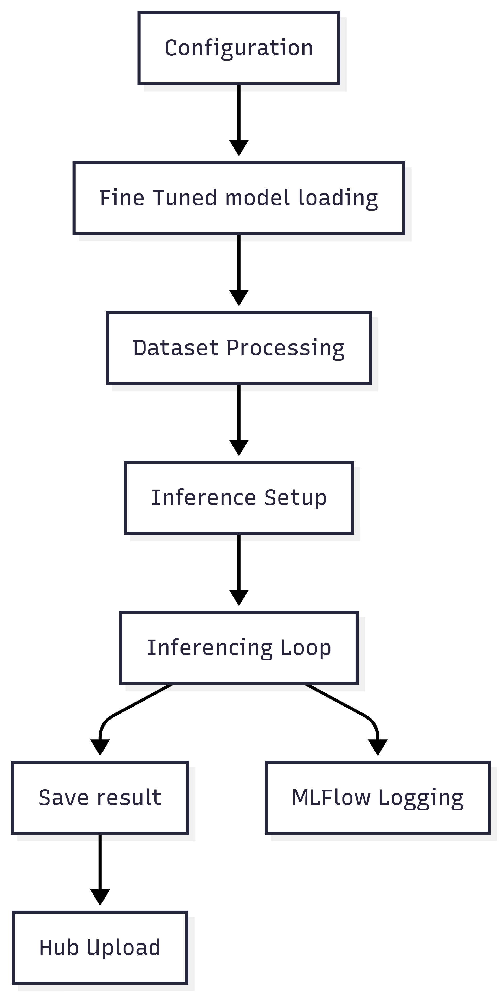

# Inferencer Component

The Inferencer component handles model inference and prediction generation from fine-tuned models. It loads your trained model and generates responses for test datasets.

## Overview

The `Inferencer` class in `app/inferencer.py` provides:

1. **Model Loading**: Loads fine-tuned models from local or Hub storage
2. **Batch Processing**: Processes test datasets efficiently
3. **Generation Control**: Configurable text generation parameters
4. **Output Management**: Saves predictions in structured format

## Key Features

- ✅ **Automatic Model Discovery**: Finds latest models automatically
- ✅ **Memory Efficient**: Supports 4-bit/8-bit quantization for inference
- ✅ **Batch Processing**: Processes multiple samples efficiently
- ✅ **Flexible Generation**: Configurable temperature, length, sampling
- ✅ **Chat Template Support**: Automatic prompt formatting
- ✅ **Performance Monitoring**: Tracks inference time and memory usage

## Architecture



## Usage

### Basic Usage

```python
from app.inferencer import Inferencer

# Initialize with default configuration
inferencer = Inferencer()

# Run inference on test dataset
results = inferencer.run()
print(f"Generated {len(results)} predictions")
```

### Custom Configuration

```python
from app.config_manager import ConfigManager
from app.inferencer import Inferencer

# Load custom configuration
config_manager = ConfigManager("custom_config.toml")
inferencer = Inferencer(config_manager=config_manager)

# Run inference
results = inferencer.run()
```

### Command Line Usage

```bash
# Basic inference
uv run app/inferencer.py --hf-key "your_token"

# With environment variables
export HF_TOKEN="your_token"
uv run app/inferencer.py
```

## Core Methods

### `load_model_and_tokenizer()`

Loads the fine-tuned model and tokenizer for inference.

```python
model, tokenizer = inferencer.load_model_and_tokenizer()
```

**Features:**
- Automatic model path construction
- Quantization support for memory efficiency
- Error handling for missing models
- Tokenizer compatibility checking

### `process_dataset()`

Processes the test dataset and prepares it for inference.

```python
processed_data = inferencer.process_dataset(dataset)
```

**Processing Steps:**
1. Column mapping validation
2. System prompt application
3. Chat template formatting
4. Batch preparation

### `generate_responses()`

Generates model responses for the processed dataset.

```python
responses = inferencer.generate_responses(processed_data)
```

**Generation Features:**
- Configurable sampling parameters
- Length control
- Temperature adjustment
- Reproducible generation with seed

## Model Loading

### Automatic Model Discovery

The inferencer constructs model paths using:

```python
model_path = f"{config.hf_user_id}/{run_name}"
```

If `run_name` is None, it searches for the most recent model.

### Quantization Support

```python
# 4-bit quantization (most memory efficient)
load_in_4bit = True

# 8-bit quantization (balanced)
load_in_8bit = True

# Full precision (highest quality)
load_in_4bit = False
load_in_8bit = False
```

### Memory Management

```python
# Memory optimization strategies
use_cache = True           # Enable KV caching
max_sequence_length = 2048 # Limit context length
batch_size = 1            # Process one sample at a time
```

## Generation Parameters

### Basic Parameters

```python
generation_config = {
    "max_new_tokens": 512,     # Maximum response length
    "temperature": 0.7,        # Randomness (0.0-1.0)
    "do_sample": True,         # Enable sampling
    "use_cache": True          # Use key-value caching
}
```

### Advanced Parameters

```python
generation_config = {
    "top_p": 0.9,             # Nucleus sampling
    "top_k": 50,              # Top-k sampling
    "min_p": 0.1,             # Min-p sampling
    "repetition_penalty": 1.1, # Avoid repetition
    "length_penalty": 1.0,     # Length preference
    "early_stopping": True     # Stop at EOS token
}
```

## Data Processing

### Input Format

The inferencer expects datasets with these columns:

```python
{
    "question": "What is machine learning?",
    "answer": "Expected response (optional)",
    "system": "System prompt (optional)"
}
```

### Column Mapping

```python
# Map your dataset columns
question_column = "input"        # Your question column
ground_truth_column = "output"   # Your answer column
system_prompt_column = "system"  # Your system prompt column
```

### Chat Template Application

```python
# Automatic template application
formatted_prompt = tokenizer.apply_chat_template(
    conversation=[
        {"role": "system", "content": system_prompt},
        {"role": "user", "content": question}
    ],
    tokenize=False
)
```

## Output Format

### JSONL Output

Results are saved to `inferencer_output.jsonl`:

```json
{
    "question": "What is machine learning?",
    "predicted_answer": "Machine learning is a subset of artificial intelligence...",
    "ground_truth": "ML is a method of data analysis...",
    "metadata": {
        "model_id": "username/model-name",
        "inference_time": 1.23,
        "token_count": 45,
        "generation_config": {...}
    }
}
```

### Batch Processing

```python
# Process multiple samples
for batch in dataset.batch(batch_size):
    responses = model.generate(
        batch["input_ids"],
        **generation_config
    )
    # Save batch results
```

## Performance Optimization

### Memory Optimization

```python
# For low-memory systems
config = {
    "load_in_4bit": True,
    "max_sequence_length": 1024,
    "batch_size": 1,
    "use_cache": True
}
```

### Speed Optimization

```python
# For faster inference
config = {
    "use_cache": True,
    "max_new_tokens": 256,
    "temperature": 0.0,  # Deterministic
    "do_sample": False   # Greedy decoding
}
```

### Quality Optimization

```python
# For better responses
config = {
    "temperature": 0.7,
    "top_p": 0.9,
    "repetition_penalty": 1.1,
    "max_new_tokens": 512
}
```

## Error Handling

### Model Loading Errors

```python
try:
    model, tokenizer = inferencer.load_model_and_tokenizer()
except ModelNotFoundError:
    print("Model not found. Check model path and authentication.")
except OutOfMemoryError:
    print("Insufficient memory. Try quantization or smaller model.")
```

### Generation Errors

```python
try:
    responses = inferencer.generate_responses(data)
except RuntimeError as e:
    if "out of memory" in str(e):
        # Reduce batch size or sequence length
        config.max_sequence_length = 1024
        config.batch_size = 1
```

## Integration with Other Components

### With Fine-Tuner

```python
# Inference follows fine-tuning
fine_tuner = FineTune()
trainer_stats = fine_tuner.run()

# Use the trained model for inference
inferencer = Inferencer()
results = inferencer.run()
```

### With Evaluator

```python
# Inference provides data for evaluation
inferencer = Inferencer()
predictions = inferencer.run()

# Evaluate the predictions
evaluator = Evaluator()
scores = evaluator.run()
```

## Advanced Usage

### Custom Generation Loop

```python
class CustomInferencer(Inferencer):
    def custom_generate(self, prompt):
        # Custom generation logic
        inputs = self.tokenizer(prompt, return_tensors="pt")
        
        with torch.no_grad():
            outputs = self.model.generate(
                **inputs,
                max_new_tokens=self.config.max_new_tokens,
                temperature=self.config.temperature,
                do_sample=True
            )
        
        response = self.tokenizer.decode(outputs[0], skip_special_tokens=True)
        return response
```

### Streaming Inference

```python
def stream_inference(self, prompt):
    """Generate responses with streaming output."""
    inputs = self.tokenizer(prompt, return_tensors="pt")
    
    # Streaming generation
    for token in self.model.generate(
        **inputs,
        max_new_tokens=self.config.max_new_tokens,
        do_sample=True,
        stream=True
    ):
        yield self.tokenizer.decode(token)
```

## Best Practices

### Memory Management
- Use 4-bit quantization for large models
- Monitor GPU memory usage during inference
- Process data in batches appropriate for your hardware

### Generation Quality
- Use appropriate temperature (0.7 for creative, 0.1 for factual)
- Set reasonable token limits to avoid truncation
- Use repetition penalty to avoid loops

### Performance
- Enable caching for repeated inference
- Use deterministic generation for reproducible results
- Monitor inference time and optimize bottlenecks

### Error Recovery
- Implement retry logic for temporary failures
- Validate model outputs before saving
- Log errors for debugging and monitoring
