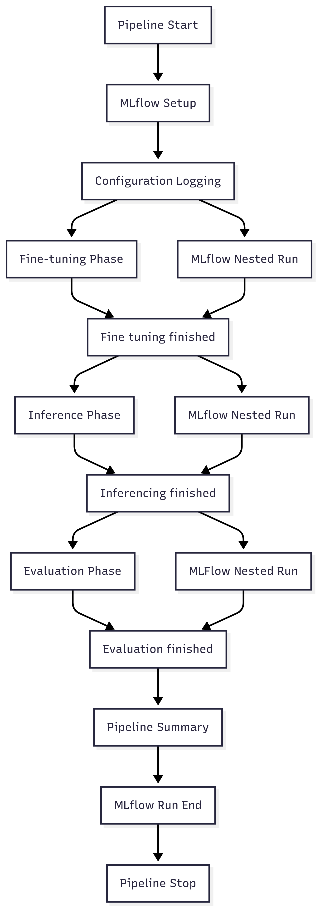

# Pipeline Orchestrator

The Pipeline Orchestrator is the central component that coordinates the execution of all pipeline phases with comprehensive MLflow tracking and experiment management.

## Overview

The `FineTunePipeline` class in `app/pipeline_invoker.py` provides:

1. **Phase Coordination**: Manages fine-tuning, inference, and evaluation phases
2. **MLflow Integration**: Complete experiment tracking and artifact logging
3. **Configuration Management**: Centralized configuration handling
4. **Error Handling**: Robust error management with detailed logging

## Key Features

- ✅ **Phase Control**: Run individual phases or complete pipeline
- ✅ **MLflow Tracking**: Automatic experiment tracking and metric logging
- ✅ **Nested Runs**: Organized experiment structure with parent/child runs
- ✅ **Artifact Management**: Automatic artifact logging and versioning
- ✅ **Metric Sanitization**: MLflow-compatible metric name sanitization
- ✅ **System Metrics**: Hardware and resource utilization tracking
- ✅ **Configuration Logging**: Complete configuration parameter tracking

## Architecture



## Usage

### Complete Pipeline

```python
from app.pipeline_invoker import FineTunePipeline

# Initialize pipeline
pipeline = FineTunePipeline(config_path="config.toml")

# Run complete pipeline
results = pipeline.run_pipeline()
```

### Individual Phases

```python
# Setup MLflow tracking
pipeline.setup_mlflow()
pipeline.start_mlflow_run()

# Run specific phases
finetuning_results = pipeline.run_finetuning()
inference_results = pipeline.run_inference()  
evaluation_results = pipeline.run_evaluation()

# Finalize tracking
pipeline.stop_mlflow_run()
```

## Command Line Interface

```bash
# Run complete pipeline
python app/pipeline_invoker.py --config config.toml

# Run with API keys
python app/pipeline_invoker.py --hf-key YOUR_HF_TOKEN --openai-key YOUR_OPENAI_KEY

# Enable specific phases
python app/pipeline_invoker.py --enable-finetuning --enable-inference --enable-evaluation
```

## MLflow Integration

### Experiment Structure

- **Parent Run**: Overall pipeline execution
- **Child Runs**: Individual phase executions (fine-tuning, inference, evaluation)
- **Metrics**: Performance metrics, durations, and system resources
- **Parameters**: Configuration parameters and run metadata
- **Artifacts**: Model files, evaluation reports, and output datasets

### Tracked Metrics

- Pipeline execution times
- Phase-specific durations
- Model performance metrics
- System resource utilization
- Evaluation scores and statistics

### Logged Artifacts

- Fine-tuned models
- Inference outputs (JSONL format)
- Evaluation reports (Excel/JSON)
- Configuration files

## Configuration

The pipeline orchestrator uses these configuration sections:

```toml
[mlflow]
tracking_uri = "http://localhost:5000"
experiment_name = "fine-tune-pipeline"

[pipeline]
enable_finetuning = true
enable_inference = true 
enable_evaluation = true
stop_after_finetuning = false
stop_after_inference = false
```

## Error Handling

The orchestrator provides comprehensive error handling:

- **Phase Isolation**: Errors in one phase don't affect others
- **MLflow Logging**: Error details logged to MLflow for debugging
- **Graceful Degradation**: Pipeline continues with remaining phases when possible
- **Detailed Messages**: Clear error messages with context

## Best Practices

### Experiment Organization

- Use descriptive experiment names
- Include timestamps in run names
- Tag runs with relevant metadata
- Use consistent naming conventions

### Resource Management

- Monitor system metrics during runs
- Use appropriate hardware configurations
- Set reasonable timeout values
- Enable resource logging for optimization

### Configuration Management

- Version control configuration files
- Use environment-specific configs
- Validate configurations before execution
- Document configuration changes

## Troubleshooting

### Common Issues

**MLflow Connection Failed**
```bash
# Check MLflow server status
mlflow server --host 0.0.0.0 --port 5000

# Verify tracking URI in config
tracking_uri = "http://localhost:5000"
```

**Phase Execution Errors**
- Check individual component logs
- Verify configuration parameters
- Review MLflow run details
- Check system resources

**Memory Issues**
- Enable gradient checkpointing
- Use quantization options
- Reduce batch sizes
- Monitor system metrics

## Advanced Features

### Custom Metric Sanitization

The pipeline automatically sanitizes metric names for MLflow compatibility:

```python
def sanitize_metric_name(name: str) -> str:
    """Sanitize metric names for MLflow"""
    name = name.replace("=", ":")
    return re.sub(r"[^a-zA-Z0-9_\-\. :/]", "_", name)
```

### System Metrics Logging

Automatic tracking of system resources:

```python
# Enable system metrics logging
mlflow.enable_system_metrics_logging()
```

### Nested Run Management

Organized experiment tracking with parent-child relationships:

```python
# Parent run for complete pipeline
with mlflow.start_run(run_name=self.run_name):
    # Child run for specific phase
    with mlflow.start_run(nested=True, run_name=phase_name):
        # Phase execution and logging
        pass
```
